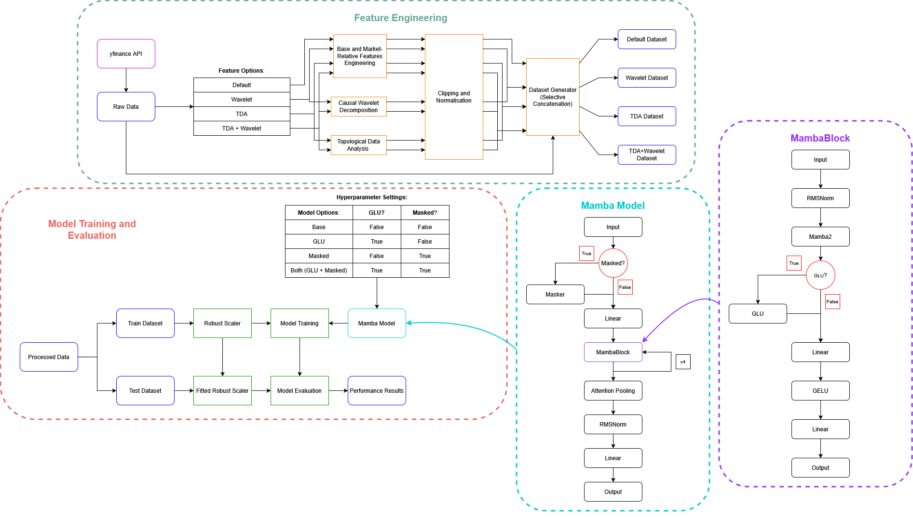

# Cross Sectional Mamba for Stock Return Prediction

This project explores Selective State Space Models for next day stock return prediction across 200 large cap US equities.

It compares Mamba with deep learning time series baselines and tests whether **Topological Data Analysis (TDA)**, **Discrete Wavelet Transforms (DWT)** and architectural modifications improve prediction.

## Approach

The overall pipeline is shown below.

The project collects daily OHLCV data, constructs several feature sets, trains different Mamba architectures and compares their performance against time series baselines.

## Feature Engineering

Four feature sets are evaluated:

| Dataset       | Features                      |
| ------------- | ----------------------------- |
| `default`     | Base financial features       |
| `wavelet`     | Base + wavelet features       |
| `tda`         | Base + TDA features           |
| `tda_wavelet` | Base + wavelet + TDA features |

Base features include log returns, Garman Klass volatility, log volume change and market relative returns. Wavelet features capture local trend and noise, while TDA features capture structural properties of the return distribution.

## Mamba Model

The model processes a 90 day window across the stock universe. Cross sectional context is calculated across stocks before each stock's time series is processed by Mamba 2 blocks.

Four variants are tested:

| Variant | GLU | Feature Masking |
| ------- | --- | --------------- |
| `base`  | No  | No              |
| `glu`   | Yes | No              |
| `mask`  | No  | Yes             |
| `both`  | Yes | Yes             |

## Baselines

Mamba is compared with:

* **InceptionTime**
* **LSTM FCN**
* **TST**

The same datasets and evaluation period are used for all models.

## Evaluation

Models are evaluated using:

* **RMSE**
* **Directional accuracy**
* **Rank IC**
* **Long short spread**
* **Sharpe ratio**

The experiments also compare training time, inference time and parameter count.

## Key Results

Mamba architectures achieved up to a 76% reduction in parameter count and over a 60% reduction in inference latency compared with the Transformer benchmark.

While the benchmark models achieved higher directional accuracy, Mamba variants using TDA and feature masking achieved stronger cross sectional performance, including a peak Rank IC and the highest Long Short Spread.

These results suggest that Mamba can provide a more computationally efficient approach to modelling cross sectional stock returns, with its stronger ranking performance indicating greater generalisation of cross sectional signals. In contrast, the higher directional accuracy of the benchmark models may indicate a greater reliance on asset specific patterns, which can perform well for individual asset predictions but may generalise less effectively across the stock universe.
